# @unireq/http

`@unireq/http` fournit le transport HTTP(S) standard basé sur `undici`, ainsi que tous les serializers, parsers, policies et helpers spécifiques au protocole.

## Installation

```bash
pnpm add @unireq/http
```

## Panorama des exports

| Catégorie | Symbols | Rôle |
| --- | --- | --- |
| Transport & connecteurs | `http`, `UndiciConnector`, `UndiciConnectorOptions` | Transport HTTP configurable (keep-alive, proxy, TLS, sockets). |
| Sérialiseurs de corps | `body.json`, `body.form`, `body.text`, `body.binary`, `body.multipart` (+ `MultipartValidationOptions`) | Encodent la requête et posent `Content-Type`. |
| Parseurs de réponse | `parse.json`, `parse.text`, `parse.blob`, `parse.stream`, `parse.sse`, `parse.raw` | Décodent la réponse et gèrent `Accept`. |
| Policies | `headers`, `query`, `timeout`, `redirectPolicy` | En-têtes dynamiques, query params, timeouts, suivi des redirections. |
| Cache conditionnel | `conditional`, `etag`, `lastModified`, `ETagPolicyOptions`, `LastModifiedPolicyOptions` | Alimente `If-None-Match` / `If-Modified-Since` et stocke les nouvelles valeurs. |
| Range & reprise | `range`, `resume`, `parseContentRange`, `supportsRange`, `RangeOptions`, `ResumeState` | Gère les téléchargements partiels et leur reprise. |
| Rate limiting | `rateLimitDelay`, `parseRetryAfter`, `RateLimitDelayOptions` | Applique `Retry-After` avant un retry. |
| Prédicat HTTP | `httpRetryPredicate`, `HttpRetryPredicateOptions` | Conditionne `retry()` avec les bonnes pratiques HTTP. |
| Intercepteurs | `interceptRequest/Response/Error`, `combine*`, `RequestInterceptor`, `ResponseInterceptor` | Instrumentation légère sans écrire de policy complète. |
| Héritage | `multipart` (legacy), `accept/json/text/raw` (préférez `parse.*`). |

## Transport & UndiciConnector

```typescript
import { client } from '@unireq/core';
import { http, UndiciConnector, headers } from '@unireq/http';

const connector = new UndiciConnector({
  keepAliveTimeout: 30_000,
  connectTimeout: 5_000,
  tls: { rejectUnauthorized: true },
});

const api = client(
  http('https://api.example.com', connector),
  headers({ 'user-agent': 'MyApp/1.0' }),
);
```

- `http(baseUrl?, connector?)` expose un transport inspectable avec capability `http`.
- Le connecteur vous laisse configurer les pools TCP, proxies, timeouts, DNS, SNI, etc.
- Passez `undefined` pour `baseUrl` si vous fournissez des URLs absolues par requête.

## Sérialiseurs `body.*`

```typescript
body.json({ query: 'unireq' });
body.form({ page: 2, sort: 'asc' });
body.text('hello world', 'text/plain; charset=utf-8');
body.binary(arrayBuffer, 'application/octet-stream');
body.multipart(
  { name: 'file', part: body.binary(fileBuffer, 'application/pdf'), filename: 'quote.pdf' },
  { name: 'meta', part: body.json({ id: 42 }) },
  {
    maxFileSize: 25 * 1024 * 1024,
    allowedMimeTypes: ['application/pdf'],
    sanitizeFilenames: true,
  },
);
```

Ces descripteurs sont compris par `serializationPolicy()` de `@unireq/core` (aucune configuration supplémentaire nécessaire).

## Parseurs `parse.*` & streaming

```typescript
import { parse } from '@unireq/http';

const asJson = parse.json();
const asText = parse.text();
const asBlob = parse.blob();
const asStream = parse.stream();
const asSSE = parse.sse();
```

- Chaque parser définit `Accept` automatiquement.
- `parse.stream()` renvoie un `ReadableStream<Uint8Array>` utilisable avec `for await` ou `getReader()`.
- `parse.sse()` convertit `text/event-stream` en `AsyncIterable<SSEEvent>` (gestion des champs `id`, `event`, `retry`).

## Policies principales

- `headers(init)` : ajoute ou calcule des en-têtes (peut recevoir une fonction `(ctx) => record`).
- `query(init)` : fusionne des paramètres dans l'URL.
- `timeout(ms | options)` : annule la requête (lève `TimeoutError`). Supporte les timeouts par phase.
- `redirectPolicy({ allow, follow303, max })` : choisit quelles redirections suivre et limite la profondeur.

### Configuration des Timeouts

La policy `timeout` supporte une configuration simple ou par phase :

```typescript
import { timeout } from '@unireq/http';

// Timeout simple (5 secondes au total)
timeout(5000);

// Timeouts par phase
timeout({
  request: 5000,  // 5s pour connexion + TTFB (jusqu'à réception des headers)
  body: 30000,    // 30s pour télécharger le body après les headers
  total: 60000,   // 60s limite totale de sécurité
});

// Combinaison avec un signal utilisateur
const controller = new AbortController();
const api = client(
  http('https://api.example.com'),
  timeout(5000),
);
// Le signal utilisateur est automatiquement combiné via AbortSignal.any()
await api.get('/data', { signal: controller.signal });
```

#### Diagramme des phases de timeout

```mermaid
gantt
    title Timeline d'une requête HTTP avec timeouts par phase
    dateFormat X
    axisFormat %s

    section Phase Request
    DNS + TCP + TLS      :req1, 0, 2
    Envoi requête        :req2, after req1, 1
    Attente headers      :req3, after req2, 2

    section Phase Body
    Téléchargement       :body1, after req3, 6

    section Timeouts
    timeout request (5s) :crit, timeout_req, 0, 5
    timeout body (30s)   :crit, timeout_body, 5, 35
    timeout total (60s)  :milestone, timeout_total, 0, 60
```



```
┌─────────────────────────────────────────────────────────────────────────────┐
│                            Timeout Total (60s)                              │
├───────────────────────────────────┬─────────────────────────────────────────┤
│       Phase Request (5s)          │           Phase Body (30s)              │
├───────────────────────────────────┼─────────────────────────────────────────┤
│ DNS → TCP → TLS → Envoi → Headers │  Téléchargement du body (streaming)     │
│       (utilise AbortSignal)       │    (utilise reader.cancel() pour        │
│                                   │     interruption réelle mid-download)   │
└───────────────────────────────────┴─────────────────────────────────────────┘
                                    ↑
                             Headers reçus
                          (transition de phase)
```

**Timeouts par phase :**
- `request` : Temps pour connexion + envoi requête + réception headers (TTFB)
- `body` : Temps alloué pour télécharger le body après réception des headers
- `total` : Timeout global (filet de sécurité qui prévaut sur les phases)

**Notes d'implémentation :**
- Utilise `AbortSignal.timeout()` natif pour une gestion efficace des timers
- Les signaux multiples sont combinés via `AbortSignal.any()` (avec fallback pour Node < 20)
- Le timeout body utilise `ReadableStream.getReader().cancel()` pour une vraie interruption mid-download
- Le cleanup est géré automatiquement pour éviter les memory leaks

## Exemples rapides par verbe HTTP

- Un seul client global, des policies ponctuelles par appel.
- Les snippets ci-dessous supposent `parse.json()` mais gardez la liberté de changer de parser selon la ressource.

```typescript
import { client } from '@unireq/core';
import { body, headers, http, parse } from '@unireq/http';

const api = client(
  http('https://api.example.com'),
  headers({ 'user-agent': 'docs-example/1.0' }),
);
```

### GET – Lecture

```typescript
const user = await api.get('/users/42', parse.json());
```

- Ajoutez `query({ include: 'profile' })` ponctuellement pour enrichir la réponse.
- Méthode idempotente : parfaite avec `retry(httpRetryPredicate())`.

### HEAD – Inspecter les en-têtes

```typescript
const head = await api.head('/files/report.pdf', parse.raw());
const size = Number(head.headers['content-length'] ?? 0);

if (size > 10 * 1024 * 1024) {
  console.log('Préparer un téléchargement chunké avant le GET');
}
```

- HEAD ne retourne que les en-têtes : exploitez-le pour vérifier `Content-Length`, `ETag` ou `Last-Modified` avant d'exécuter un `GET` coûteux.
- Combinez-le avec `get()` + `If-None-Match` pour vos stratégies de cache conditionnelles.

### POST – Création

```typescript
const payload = { email: 'jane@example.com', name: 'Jane' };
const created = await api.post('/users', body.json(payload), parse.json());
```

- `body.json()` encode et définit `Content-Type` automatiquement.
- Pensez à `headers({ 'x-idempotency-key': crypto.randomUUID() })` lorsque l'API supporte les replays.

### PUT – Remplacement complet

```typescript
await api.put('/users/42', body.json({ id: 42, name: 'Jane Updated' }), parse.json());
```

- Combinez avec `etag()` / `lastModified()` pour éviter d'écraser des modifications concurrentes.
- Idempotent → compatible avec les retries automatiques.

### PATCH – Mise à jour partielle

```typescript
await api.patch('/users/42', body.json({ name: 'Jane v2' }), parse.json());
```

- Ajustez `Content-Type` (`application/merge-patch+json`, `json-patch`) selon les conventions du serveur.
- Utilisez `either()` pour router vers différents formats de patch.

### DELETE – Suppression

```typescript
await api.delete('/users/42', parse.raw());
```

- Les réponses `204` n'ont pas de corps : ajoutez `parse.raw()` ou aucun parser si nécessaire.
- Ajoutez un en-tête applicatif (`x-confirm-delete`) ou un token CSRF pour éviter les suppressions accidentelles.

### OPTIONS – Prévol / capacités

```typescript
const preflight = await api.options('/users', headers({ Origin: 'https://app.example.com' }), parse.raw());
console.log(preflight.headers['access-control-allow-methods']);
```

- Utile pour interroger dynamiquement les méthodes supportées (CORS, WebDAV, versionnement REST).
- Mettre en cache la réponse avec `conditional()` ou `cachePolicy` évite de répéter le prévol.

## Cache conditionnel

```typescript
import { conditional, etag, lastModified } from '@unireq/http';

const cache = client(
  http('https://api.example.com'),
  conditional(),
);

const etagAware = client(
  http('https://api.example.com'),
  etag({ get: cacheStore.getEtag, set: cacheStore.setEtag }),
);
```

- `conditional()` combine automatiquement ETag + Last-Modified.
- `etag` / `lastModified` acceptent vos stores (sync/async) pour lire/écrire les valeurs des headers.

## Range & reprise de téléchargements

```typescript
import { range, resume, supportsRange, parseContentRange } from '@unireq/http';

const chunked = client(http('https://files.example.com'), range({ start: 0, end: 1023 }));

const resumed = client(http(), resume({ downloaded: bytes déjà reçus }));
```

- `supportsRange(response)` vérifie `Accept-Ranges`.
- `parseContentRange(header)` aide à calculer la taille totale restante.
- `resume({ downloaded })` continue un téléchargement partiel en envoyant `Range: bytes={downloaded}-`.

## Rate limiting & Retry-After

- `parseRetryAfter(headers)` renvoie une date ou un délai en ms.
- `rateLimitDelay({ maxWait })` s'utilise comme première stratégie dans `retry()` pour respecter `Retry-After`.

```typescript
import { retry } from '@unireq/core';
import { httpRetryPredicate, rateLimitDelay } from '@unireq/http';

const smartRetry = retry(
  httpRetryPredicate({ statusCodes: [429, 503] }),
  [rateLimitDelay({ maxWait: 60_000 })],
);
```

## Prédicat HTTP pour `retry()`

`httpRetryPredicate({ methods, statusCodes, maxBodySize })` encapsule les bonnes pratiques : ne réessayer que les méthodes idempotentes (GET/HEAD/PUT/DELETE par défaut), ignorer les réponses hors liste, éviter de rejouer les payloads volumineux. Branchez-le directement sur le `retry()` générique de `@unireq/core`.

## Intercepteurs

```typescript
import { interceptRequest, interceptResponse } from '@unireq/http';

const instrumented = client(
  http('https://api.example.com'),
  interceptRequest((ctx) => {
    console.log('→', ctx.method, ctx.url);
    return ctx;
  }),
  interceptResponse((res, ctx) => {
    console.log('←', res.status, ctx.url);
    return res;
  }),
);
```

- `combineRequestInterceptors` / `combineResponseInterceptors` facilitent la composition.
- `interceptError` convertit une erreur réseau en une valeur métier ou déclenche des métriques spécifiques.

## Exports hérités

- `multipart` (legacy) reste disponible mais préférez `body.multipart()`.
- `accept`, `json`, `text`, `raw` sont conservés pour compatibilité mais `parse.*` est la voie recommandée.

---

<p align="center">
  <a href="#/fr/packages/core">← Core</a> · <a href="#/fr/packages/http2">HTTP/2 →</a>
</p>
