# @unireq/http

`@unireq/http` provides Unireq's standard HTTP(S) transport built on `undici`, along with an arsenal of serializers, parsers, policies, and protocol-specific helpers.

## Installation

```bash
pnpm add @unireq/http
```

## Export Overview

| Category | Symbols | Purpose |
| --- | --- | --- |
| Transport & connectors | `http`, `UndiciConnector`, `UndiciConnectorOptions` | HTTP/1.1 transport with keep-alive support, custom proxies, TLS tuning. |
| Body serializers | `body.json`, `body.form`, `body.text`, `body.binary`, `body.multipart` (+ validation options) | Encode requests and automatically set `Content-Type`. |
| Response parsers | `parse.json`, `parse.text`, `parse.blob`, `parse.stream`, `parse.sse`, `parse.raw` | Decode responses and handle `Accept`. |
| Policies | `headers`, `query`, `timeout`, `redirectPolicy` | Add headers, query params, timeouts, redirect handling. |
| Conditional caching | `conditional`, `etag`, `lastModified`, `ETagPolicyOptions`, `LastModifiedPolicyOptions` | Handle `If-None-Match` / `If-Modified-Since` and update local caches. |
| Range & resume | `range`, `resume`, `parseContentRange`, `supportsRange`, `RangeOptions`, `ResumeState` | Partial downloads and stream resumption. |
| Rate limiting | `rateLimitDelay`, `parseRetryAfter`, `RateLimitDelayOptions` | Respect `Retry-After` headers and client-side backpressure. |
| Retry predicate | `httpRetryPredicate`, `HttpRetryPredicateOptions` | HTTP-specific condition for `@unireq/core`'s generic `retry`. |
| Interceptors | `interceptRequest`, `interceptResponse`, `interceptError`, `combine*`, `RequestInterceptor`, `ResponseInterceptor` | Hook logging/metrics or modify requests/responses without writing a full policy. |
| Legacy helpers | `multipart` (will be replaced by `body.multipart`), `accept/json/raw/text` (prefer `parse.*`). |

## Transport & Connector

```typescript
import { client } from '@unireq/core';
import { http, UndiciConnector } from '@unireq/http';

const connector = new UndiciConnector({
  keepAlive: true,
  connectTimeout: 5_000,
  tls: { rejectUnauthorized: true },
});

const api = client(
  http('https://api.example.com', connector),
  headers({ 'user-agent': 'MyApp/1.0' }),
);
```

- `http(baseUrl?, connector?)` returns an inspectable transport with the `http` capability.
- The `connector` lets you customize TCP pool, HTTP/HTTPS proxies, keep-alive, DNS, shared sockets, etc.
- Passing `undefined` as `baseUrl` allows using full URLs per request.

## Body Serializers

The `body.*` helpers create *descriptors* understood by `serializationPolicy()`:

```typescript
body.json(payload, { compress: false });
body.form({ search: 'unireq', page: 2 });
body.text('plain text', 'text/plain; charset=utf-8');
body.binary(arrayBuffer, 'application/octet-stream');
body.multipart(
  { name: 'file', part: body.binary(fileBuffer, 'application/pdf'), filename: 'quote.pdf' },
  { name: 'meta', part: body.json({ customerId: 42 }) },
  {
    maxFileSize: 25 * 1024 * 1024,
    allowedMimeTypes: ['application/pdf'],
    sanitizeFilenames: true,
  },
);
```

## Response Parsers & Streaming

```typescript
import { parse } from '@unireq/http';

const getJson = parse.json();
const getText = parse.text();
const getBlob = parse.blob();
const streamDownload = parse.stream(); // Web ReadableStream
const streamEvents = parse.sse();      // AsyncIterable<SSEEvent>
```

- Each parser automatically adjusts the `Accept` header.
- `parse.stream(options?)` exposes a `ReadableStream<Uint8Array>` usable with `for await` or `getReader()`.
- `parse.sse(options?)` converts `text/event-stream` into `AsyncIterable<SSEEvent>` with retry, multi-line, and comment support.

## Core Policies

- `headers(record | (ctx) => record)`: adds or computes headers.
- `query(record | (ctx) => record)`: merges query parameters.
- `timeout(ms | options)`: cancels the request if duration is exceeded (throws `TimeoutError`). Supports per-phase timeouts.
- `redirectPolicy({ allow, follow303, max })`: controls which codes to follow (default 307/308). Enable `follow303` for POST→GET backward compatibility.

### Timeout Configuration

The `timeout` policy supports both simple and per-phase configurations:

```typescript
import { timeout } from '@unireq/http';

// Simple timeout (5 seconds total)
timeout(5000);

// Per-phase timeouts
timeout({
  request: 5000,  // 5s for connection + TTFB (until headers received)
  body: 30000,    // 30s for body download after headers
  total: 60000,   // 60s total safety limit
});

// Combine with user abort signal
const controller = new AbortController();
const api = client(
  http('https://api.example.com'),
  timeout(5000),
);
// User signal is automatically combined with timeout using AbortSignal.any()
await api.get('/data', { signal: controller.signal });
```

#### Timeout Phases Diagram

```mermaid
gantt
    title HTTP Request Timeline with Per-Phase Timeouts
    dateFormat X
    axisFormat %s

    section Request Phase
    DNS + TCP + TLS      :req1, 0, 2
    Send Request         :req2, after req1, 1
    Wait for Headers     :req3, after req2, 2

    section Body Phase
    Download Body        :body1, after req3, 6

    section Timeouts
    request timeout (5s) :crit, timeout_req, 0, 5
    body timeout (30s)   :crit, timeout_body, 5, 35
    total timeout (60s)  :milestone, timeout_total, 0, 60
```



```
┌─────────────────────────────────────────────────────────────────────────────┐
│                              Total Timeout (60s)                            │
├───────────────────────────────────┬─────────────────────────────────────────┤
│       Request Phase (5s)          │           Body Phase (30s)              │
├───────────────────────────────────┼─────────────────────────────────────────┤
│ DNS → TCP → TLS → Send → Headers  │  Download response body (streaming)     │
│        (uses AbortSignal)         │    (uses reader.cancel() for true       │
│                                   │     interruption mid-download)          │
└───────────────────────────────────┴─────────────────────────────────────────┘
                                    ↑
                              Headers received
                            (phase transition)
```

**Phase timeouts:**
- `request`: Time for connection + sending request + receiving headers (TTFB)
- `body`: Time allowed to download the response body after headers are received
- `total`: Overall request timeout (safety net that overrides phases)

**Implementation notes:**
- Uses native `AbortSignal.timeout()` for efficient timer management
- Multiple signals are combined using `AbortSignal.any()` (with fallback for Node < 20)
- Body timeout uses `ReadableStream.getReader().cancel()` for true mid-download interruption
- All cleanup is handled automatically to prevent memory leaks

## Quick Examples by HTTP Verb

- Declare a single client, then compose request-specific policies.
- The examples below use `parse.json()` globally; adapt as needed (streaming, text, binary, etc.).

```typescript
import { client } from '@unireq/core';
import { body, headers, http, parse } from '@unireq/http';

const api = client(
  http('https://api.example.com'),
  headers({ 'user-agent': 'docs-example/1.0' }),
  parse.json(),
);
```

### GET – Simple Read

```typescript
const user = await api.get('/users/42', parse.json());
```

- Add one-off policies for this request: `await api.get('/users/42', query({ include: 'profile' }));`
- Ideal with `retry()` since `GET` is idempotent.

### HEAD – Inspect Headers

```typescript
const head = await api.head('/files/report.pdf', parse.raw());
const size = Number(head.headers['content-length'] ?? 0);

if (size > 10 * 1024 * 1024) {
  console.log('Prepare chunked download before GET');
}
```

- HEAD returns only headers: use it to check `Content-Length`, `ETag`, or last modified before executing a `GET`.
- Combine with `get()` and an `If-None-Match` header to implement a respectful conditional fetch.

### POST – Creation

```typescript
const payload = { email: 'jane@example.com', name: 'Jane' };
const created = await api.post('/users', body.json(payload), parse.json());
```

- `body.json()` automatically sets `Content-Type` and handles encoding.
- Add `headers({ 'x-idempotency-key': crypto.randomUUID() })` if you want to make the operation server-side safe.

### PUT – Full Replacement

```typescript
await api.put('/users/42', body.json({ id: 42, name: 'Jane Updated' }), parse.json());
```

- Combine with `etag()` to avoid overwriting concurrent modifications: `await api.put(..., etagPolicy);`.
- Idempotent by nature → compatible with `retry(httpRetryPredicate())`.

### PATCH – Partial Update

```typescript
await api.patch('/users/42', body.json({ name: 'Jane v2' }), parse.json());
```

- Add `headers({ 'content-type': 'application/merge-patch+json' })` or `application/json-patch+json` depending on your API.
- Convenient to combine with `either()` to select the patch format.

### DELETE – Removal

```typescript
await api.delete('/users/42', parse.raw());
```

- Many APIs return `204 No Content`; add `parse.raw()` if you don't expect a body.
- Secure via `headers({ 'x-confirm-delete': 'true' })` or a CSRF token.

### OPTIONS – Preflight/Capabilities

```typescript
const preflight = await api.options('/users', headers({ Origin: 'https://app.example.com' }), parse.raw());
console.log(preflight.headers['access-control-allow-methods']);
```

- Useful for dynamically checking endpoint capabilities (CORS, versioning, webdav…).
- Combine with `cachePolicy` to cache long-duration preflights.

## Conditional Requests & Client-side Cache

```typescript
import { etag, lastModified, conditional } from '@unireq/http';

const cachePolicy = conditional();
const useEtag = etag({ get: cache.getEtag, set: cache.setEtag });
const useLastModified = lastModified({ get: cache.getDate, set: cache.setDate });
```

- `conditional()` combines ETag + Last-Modified if available.
- `etag` and `lastModified` accept your own stores (synchronous or asynchronous) to apply `If-None-Match` / `If-Modified-Since` and update values when a 200 returns.

## Range Requests & Resume

```typescript
import { range, resume, supportsRange, parseContentRange } from '@unireq/http';

const resumeDownload = client(
  http('https://files.example.com'),
  range({ start: 0, end: 1023 }),
);

const nextChunk = client(
  http(),
  resume({ downloaded: previousBytes }),
);
```

- `supportsRange(response)` checks for the presence of `Accept-Ranges`.
- `parseContentRange(header)` helps determine how many bytes remain.
- `resume({ downloaded })` automatically resumes a partial download by sending `Range: bytes={downloaded}-`.

## Rate Limiting Helpers

- `parseRetryAfter(headers)` returns either a date or a delay in milliseconds.
- `rateLimitDelay({ maxWait })` is designed to be the first strategy for `retry()`: it reads `Retry-After` and returns a delay if present.

```typescript
import { retry } from '@unireq/core';
import { httpRetryPredicate, rateLimitDelay } from '@unireq/http';

const smartRetry = retry(
  httpRetryPredicate({ statusCodes: [429, 503] }),
  [rateLimitDelay({ maxWait: 60_000 })],
);
```

## HTTP-aware Retry Predicate

`httpRetryPredicate({ methods, statusCodes, maxBodySize })` encapsulates HTTP best practices (retry only idempotent methods by default, ignore payloads that are too large, etc.). Plug it directly into `retry()` for consistent behavior across all HTTP clients.

## Interceptors

Use `interceptRequest`, `interceptResponse`, or `interceptError` to instrument without creating a full policy:

```typescript
import { interceptRequest, interceptResponse } from '@unireq/http';

const withLogging = client(
  http('https://api.example.com'),
  interceptRequest((ctx) => {
    console.log('→', ctx.method, ctx.url);
    return ctx;
  }),
  interceptResponse((res, ctx) => {
    console.log('←', res.status, ctx.url);
    return res;
  }),
);
```

- `combineRequestInterceptors(...interceptors)` / `combineResponseInterceptors(...)` facilitate composition.
- `interceptError` allows you, for example, to convert certain errors into business values.

## Legacy Exports

- `multipart` (outside `body.*`) remains available but will be removed in favor of `body.multipart()`.
- `accept`, `json`, `text`, `raw` remain for compatibility but prefer `parse.*` which integrates with the slot system.

## Troubleshooting

### "NetworkError" or connection refused

**Cause:** Server unreachable, DNS failure, or TLS issues.

**Fix:** Verify network connectivity and server availability:

```typescript
import { client } from '@unireq/core';
import { http } from '@unireq/http';

// Check with explicit error handling
try {
  const api = client(http('https://api.example.com'));
  await api.get('/health');
} catch (error) {
  if (error.code === 'NETWORK_ERROR') {
    console.error('Server unreachable:', error.cause);
  }
}
```

### Response body is empty or undefined

**Cause:** Missing parser policy or wrong parser type.

**Fix:** Add the appropriate parser:

```typescript
// Wrong - no parser
const res = await api.get('/users');
console.log(res.data); // undefined!

// Correct - add parse.json()
const res = await api.get('/users', parse.json());
console.log(res.data); // { users: [...] }

// For non-JSON responses
const text = await api.get('/readme', parse.text());
const blob = await api.get('/image.png', parse.blob());
```

### "TimeoutError" after short delay

**Cause:** Timeout too aggressive or slow network.

**Fix:** Increase timeout or use per-phase timeouts:

```typescript
import { timeout } from '@unireq/http';

// Simple timeout
timeout(30_000); // 30 seconds

// Per-phase timeouts for fine control
timeout({
  request: 10000,  // 10s for connection + TTFB
  body: 60000,     // 60s for body download
  total: 120000,   // Overall limit
});
```

### Multipart upload fails with "Invalid MIME type"

**Cause:** File MIME type not in allowed list.

**Fix:** Add the MIME type to `allowedMimeTypes`:

```typescript
body.multipart(
  { name: 'file', part: body.binary(buffer, 'application/vnd.ms-excel'), filename: 'data.xls' },
  {
    allowedMimeTypes: [
      'application/pdf',
      'image/*',
      'application/vnd.ms-excel',
      'application/vnd.openxmlformats-officedocument.spreadsheetml.sheet',
    ],
  },
);
```

### Redirects not followed

**Cause:** `redirectPolicy` not configured or redirect code not allowed.

**Fix:** Configure redirect handling:

```typescript
import { redirectPolicy } from '@unireq/http';

const api = client(
  http('https://api.example.com'),
  redirectPolicy({
    allow: [301, 302, 307, 308],
    follow303: true, // Follow 303 with GET
    max: 10,         // Maximum redirects
  }),
);
```

### Rate limiting (429) causing failures

**Cause:** Not respecting `Retry-After` header.

**Fix:** Use `rateLimitDelay` with retry:

```typescript
import { retry } from '@unireq/core';
import { httpRetryPredicate, rateLimitDelay } from '@unireq/http';

const api = client(
  http('https://api.example.com'),
  retry(
    httpRetryPredicate({ statusCodes: [429, 503] }),
    [rateLimitDelay({ maxWait: 120_000 })], // Wait up to 2 minutes
    { tries: 5 },
  ),
);
```

### SSE stream closes unexpectedly

**Cause:** Connection timeout or server-side close.

**Fix:** Handle reconnection in your SSE consumer:

```typescript
const events = await api.get('/events', parse.sse({
  reconnect: true,
  reconnectInterval: 3000,
}));

for await (const event of events) {
  if (event.type === 'error') {
    console.error('SSE error, will reconnect:', event.data);
    continue;
  }
  handleEvent(event);
}
```

### ETag/Last-Modified not working

**Cause:** Cache store not properly configured.

**Fix:** Ensure your cache store implements get/set correctly:

```typescript
import { etag, lastModified } from '@unireq/http';

const etagCache = new Map<string, string>();
const dateCache = new Map<string, string>();

const api = client(
  http('https://api.example.com'),
  etag({
    get: (url) => etagCache.get(url),
    set: (url, value) => etagCache.set(url, value),
  }),
  lastModified({
    get: (url) => dateCache.get(url),
    set: (url, value) => dateCache.set(url, value),
  }),
);
```

---

<p align="center">
  <a href="#/packages/core">← Core</a> · <a href="#/packages/http2">HTTP/2 →</a>
</p>
