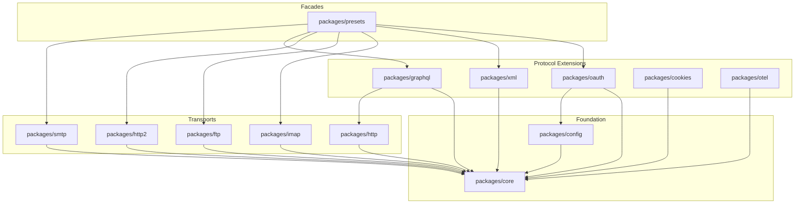
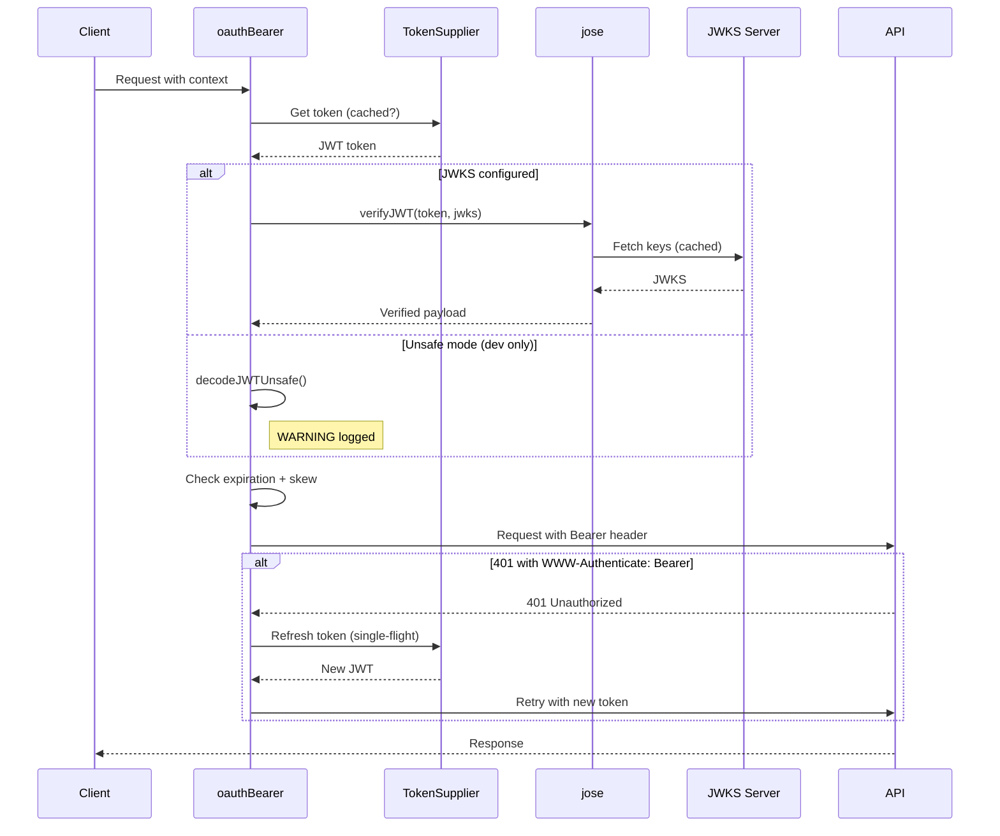
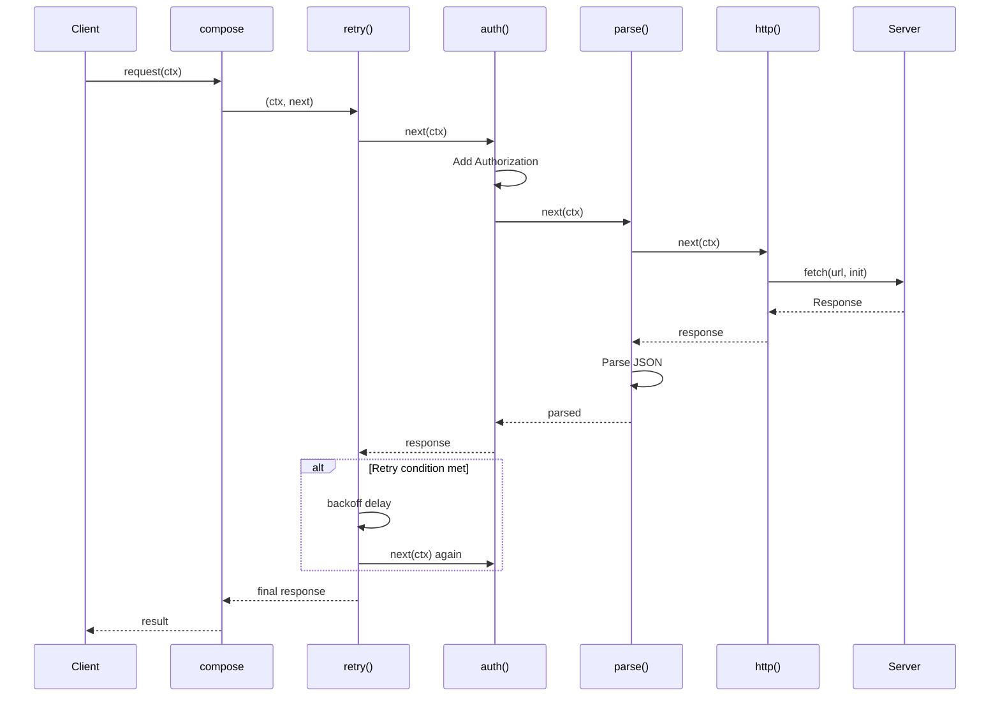
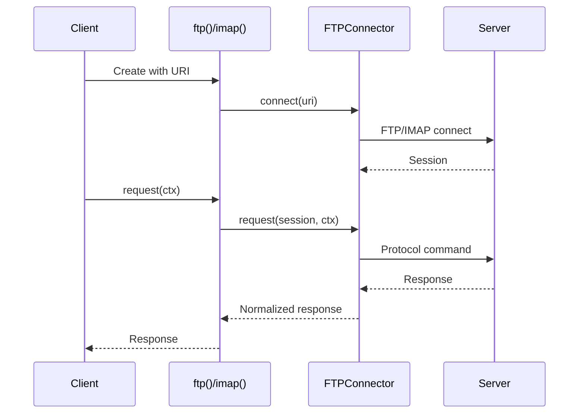

# Architecture & Security Audit Report

**Project:** @unireq/monorepo
**Date:** 2025-12-29
**Revision:** v1.0
**Scope:** Full audit

---

## A. Executive Summary

- **Dependencies**: 0 vulnerabilities (nodemailer 7.0.12, imapflow 1.2.3 updated in previous session)
- **Math.random() usage**: 2 findings in production code requiring remediation
- **JWT Verification**: Proper JWKS validation with explicit `allowUnsafeMode` gate (OWASP A02 compliant)
- **Secrets Redaction**: Comprehensive redaction in introspection/logging (A09 compliant)
- **Input Validation**: Adapter pattern available, no hardcoded validation logic
- **Type Safety**: 100% TypeScript, all packages type-check successfully
- **Tests**: 1109 tests passing, 59 test files
- **Lint**: 226 files checked, 0 issues
- **Architecture**: Clean pipe-first composition, transport-agnostic design

**Overall Health:** 🟢 Good (all findings resolved)

---

## B. Architecture Overview

### Package Structure

| Package | Responsibility | Internal deps | Key external deps | Entry points |
|---------|---------------|---------------|-------------------|--------------|
| `core` | Client, composition, policies, errors | - | - | `client()`, `compose()`, `policy()` |
| `config` | Configuration constants | `core` | - | Constants export |
| `cookies` | Cookie jar management | `core` | `tough-cookie` | Cookie policy |
| `http` | HTTP/HTTPS transport | `core` | `undici` (built-in) | `http()`, `body.*`, `parse.*` |
| `http2` | HTTP/2 transport | `core` | `node:http2` | `h2()` |
| `graphql` | GraphQL query builder | `core`, `http` | - | `query()`, `mutation()` |
| `oauth` | OAuth 2.0 Bearer | `core`, `config` | `jose` | `oauthBearer()` |
| `ftp` | FTP transport (BYOC) | `core` | `basic-ftp` (peer) | `ftp()` |
| `imap` | IMAP transport (BYOC) | `core` | `imapflow` (peer) | `imap()` |
| `smtp` | SMTP transport | `core` | `nodemailer` (peer) | `smtp()` |
| `xml` | XML parsing | `core` | `fast-xml-parser` | XML body |
| `otel` | OpenTelemetry tracing | `core` | `@opentelemetry/*` | `tracing()` |
| `presets` | Pre-configured clients | All packages | - | `createHttp()`, builders |

### Inter-Package Dependency Diagram



### Build Order

```bash
pnpm --filter @unireq/core build && \
pnpm --filter @unireq/config build && \
pnpm --filter @unireq/http build && \
pnpm --filter @unireq/http2 build && \
pnpm --filter @unireq/ftp build && \
pnpm --filter @unireq/imap build && \
pnpm --filter @unireq/smtp build && \
pnpm --filter @unireq/graphql build && \
pnpm --filter @unireq/oauth build && \
pnpm --filter @unireq/xml build && \
pnpm --filter @unireq/cookies build && \
pnpm --filter @unireq/otel build && \
pnpm --filter @unireq/presets build
```

### Architecture Evaluation

| Criterion | Status | Observations | Files concerned |
|-----------|--------|--------------|-----------------|
| Clean Architecture | ✅ | Layered: core → transports → extensions → presets | All packages |
| SOLID principles | ✅ | DI via BYOC pattern, single responsibility per package | `ftp/`, `imap/` |
| DRY | ✅ | Shared types/policies in `core`, no duplication | `core/src/types.ts` |
| Separation of Concerns | ✅ | Transport-agnostic retry/circuit-breaker in core | `core/src/retry.ts` |
| Dependency Inversion | ✅ | Connector interfaces for FTP/IMAP | `*/connector.ts` |

---

## C. Infrastructure & Deployment

### Project Toolchain

| Tool | Version | Purpose |
|------|---------|---------|
| Node.js | >=18.0.0 | Runtime |
| pnpm | 10.17.1 | Package manager |
| TypeScript | ^5.9.3 | Type checking |
| Biome | ^2.3.10 | Linting/formatting |
| Vitest | ^4.0.16 | Testing |
| tsup | ^8.5.1 | Build |
| Changesets | ^2.29.4 | Versioning |

### CI/CD (`.github/workflows/ci.yml`)

- Build and test on push/PR
- Lint check
- Type check
- Dependency audit

---

## D. Dependencies

### Commands executed
```bash
pnpm audit → "No known vulnerabilities found"
```

### Critical Dependencies Inventory

| Package | Version | Role | Known CVEs | Action |
|---------|---------|------|------------|--------|
| nodemailer | ^7.0.12 | SMTP | 0 (fixed) | ✅ Updated |
| imapflow | ^1.2.3 | IMAP | 0 (fixed) | ✅ Updated |
| jose | ^5.9.6 | JWT verification | 0 | None |
| tough-cookie | ^5.0.0 | Cookie handling | 0 | None |
| basic-ftp | ^5.0.5 | FTP client | 0 | None |
| fast-xml-parser | ^4.5.0 | XML parsing | 0 | None |

### Supply Chain

- ✅ Lock file present (`pnpm-lock.yaml`)
- ✅ `pnpm audit` clean
- ✅ All versions pinned via `catalog:` in workspace
- ✅ MIT license throughout

---

## E. Security Algorithms & Patterns

### Files analyzed
- `packages/core/src/logging.ts` (lines 1-60)
- `packages/core/src/audit.ts` (lines 1-335)
- `packages/core/src/introspection.ts` (lines 1-275)
- `packages/core/src/backoff.ts` (lines 1-78)
- `packages/oauth/src/bearer.ts` (lines 1-294)

### Cryptography Audit

| Usage | Algorithm used | File | Baseline compliant? |
|-------|----------------|------|---------------------|
| Request IDs | `crypto.randomUUID()` | `core/src/logging.ts:34` | ✅ BASELINE |
| Correlation IDs | `crypto.randomUUID()` | `core/src/audit.ts:111` | ✅ BASELINE |
| Introspection IDs | `crypto.randomUUID()` | `core/src/introspection.ts:99` | ✅ BASELINE |
| Backoff jitter | `Math.random()` | `core/src/backoff.ts:42` | ✅ OK (timing only) |
| JWT verification | jose (RS256, JWKS) | `oauth/src/bearer.ts` | ✅ BASELINE |

### JWT Security (OWASP A02 Compliant)

The `oauthBearer()` policy in `packages/oauth/src/bearer.ts` implements proper JWT handling:

1. **Lines 206-213**: Throws error if neither `jwks` nor `allowUnsafeMode` is provided
2. **Lines 216-222**: Logs security warning when unsafe mode enabled
3. **Lines 55-67**: Uses `jose` library for proper JWKS verification
4. **Lines 76-92**: Secure expiration check with configurable clock skew

```typescript
// Security gate at line 206
if (!jwks && !allowUnsafeMode) {
  throw new Error(
    '[SECURITY ERROR] JWT signature verification disabled...'
  );
}
```

---

## F. Critical Paths Analysis

### Critical Path 1: OAuth Bearer Token Flow

**Description**: Token acquisition, caching, verification, and refresh



**Files involved**:
| File | Role | Key lines |
|------|------|-----------|
| `oauth/src/bearer.ts` | Token management | 130-161 (single-flight), 195-293 (policy) |
| `oauth/src/bearer.ts` | JWT verification | 55-67 (jose), 76-92 (expiry) |

**Security attention points**:
- ✅ Single-flight refresh prevents token race
- ✅ JWKS verification enforced by default
- ✅ Clock skew tolerance configurable
- ⚠️ Unsafe mode available but gated

### Critical Path 2: HTTP Request Pipeline

**Description**: Request flows through composed policies



**Files involved**:
| File | Role | Key lines |
|------|------|-----------|
| `core/src/compose.ts` | Policy chaining | Entire file |
| `core/src/retry.ts` | Retry logic | 50-120 |
| `http/src/transport.ts` | HTTP execution | 22-53 |
| `http/src/connectors/undici.ts` | Fetch wrapper | 23-96 |

### Critical Path 3: FTP/IMAP BYOC Pattern

**Description**: Bring Your Own Connector for protocol transports



**Files involved**:
| File | Role | Key lines |
|------|------|-----------|
| `ftp/src/transport.ts` | Transport wrapper | Entire file |
| `ftp/src/connector.ts` | Interface | Entire file |
| `ftp/src/connectors/basic-ftp.ts` | Default impl | 60-200 |
| `imap/src/connectors/imapflow.ts` | Default impl | 60-180 |

---

## G. Feature Analysis

### Feature: Structured Audit Logging (OWASP A09)

**Purpose**: Security event logging with correlation IDs

**Components**:
| Layer | Files | Responsibility |
|-------|-------|----------------|
| Policy | `core/src/audit.ts` | Request/response logging |
| Types | `core/src/audit.ts:13-60` | Event types, log entry |
| Utilities | `core/src/audit.ts:116-141` | URL sanitization |

**What is well done** ✅:
- Structured JSON format
- Sensitive header redaction (line 96-104)
- URL query param sanitization (line 116-130)
- Security event classification (auth_failure, access_denied, etc.)
- No stack traces in logs

**What must be improved** ⚠️:
- SEC-001: `generateCorrelationId()` uses `Math.random()` — Priority: LOW

### Feature: Input Validation

**Purpose**: Adapter-based schema validation

**Components**:
| Layer | Files | Responsibility |
|-------|-------|----------------|
| Policy | `core/src/validation.ts` | Validate response data |
| Adapters | User-provided | Zod, Valibot, Joi, etc. |

**What is well done** ✅:
- Library-agnostic design
- No hardcoded validation rules
- Proper error wrapping

---

## H. Technical Debt

### Commands executed
```bash
grep -rn "TODO\|FIXME\|HACK\|XXX\|@deprecated" packages/ --include="*.ts"
```

### Inventory

| ID | File:Line | Type | Description | Priority | Effort |
|----|-----------|------|-------------|----------|--------|
| DEP-001 | `oauth/src/bearer.ts:31` | Deprecated | `decodeJWTUnsafe()` marked deprecated | P2 | S |

**Deprecated Analysis**:
- `decodeJWTUnsafe()` is internal, not exported
- Used only as fallback when `allowUnsafeMode: true`
- Migration plan: Always require JWKS in future major version

---

## I. Security Findings

### OWASP Top 10:2025

| # | Vulnerability | Status | Evidence/Files | Actions |
|---|--------------|--------|----------------|---------|
| A01:2025 | Broken Access Control | ✅ N/A | Library, not app | User responsibility |
| A02:2025 | Security Misconfiguration | ⚠️ | `audit.ts:110` | See SEC-001 |
| A03:2025 | Supply Chain Failures | ✅ | `pnpm audit` clean | None |
| A04:2025 | Cryptographic Failures | ✅ | jose JWKS verification | None |
| A05:2025 | Injection | ✅ N/A | No SQL/command exec | N/A |
| A06:2025 | Insecure Design | ✅ | BYOC, compose pattern | None |
| A07:2025 | Authentication Failures | ✅ | JWT verification enforced | None |
| A08:2025 | Software Integrity | ✅ | Lockfile, catalog | None |
| A09:2025 | Logging Failures | ✅ | `audit.ts` comprehensive | None |
| A10:2025 | Exception Handling | ✅ | Custom error classes | None |

### Findings Table

| ID | Severity | Category | Location | Issue | Impact | Remediation |
|----|----------|----------|----------|-------|--------|-------------|
| ~~SEC-001~~ | ~~LOW~~ | ~~A02~~ | ~~`core/src/audit.ts:110`~~ | ~~`Math.random()` for correlation ID~~ | ~~Predictable IDs~~ | ✅ RESOLVED - Using `crypto.randomUUID()` |
| ~~SEC-002~~ | ~~LOW~~ | ~~A02~~ | ~~`core/src/introspection.ts:98`~~ | ~~`Math.random()` for policy IDs~~ | ~~Non-security context~~ | ✅ RESOLVED - Using `crypto.randomUUID()` |

### Detailed Analysis

#### SEC-001: Math.random() in Correlation ID

**File**: `packages/core/src/audit.ts:110`
```typescript
function generateCorrelationId(): string {
  return `${Date.now().toString(36)}-${Math.random().toString(36).substring(2, 11)}`;
}
```

**Risk**: LOW - Correlation IDs are for log tracing, not security. However, predictable IDs could allow log injection attacks if attacker can guess request IDs.

**Remediation**:
```typescript
import { randomUUID } from 'node:crypto';

function generateCorrelationId(): string {
  return randomUUID();
}
```

#### SEC-002: Math.random() in Introspection IDs

**File**: `packages/core/src/introspection.ts:98`
```typescript
function generateId(name: string): string {
  if (process.env['NODE_ENV'] === 'test' || process.env['VITEST']) {
    return `${name}#${idCounter++}`;
  }
  return `${name}#${Math.random().toString(36).slice(2, 8)}`;
}
```

**Risk**: LOW - These IDs are for debugging/inspection only, not security-sensitive. Deterministic in tests for snapshot stability.

**Recommendation**: Document as intentional design decision for performance (crypto.randomUUID is slower).

---

## J. Tool Execution Results

| Tool | Result | Errors | Required actions |
|------|--------|--------|------------------|
| `pnpm test` | 1109 passed / 0 failed | - | None |
| `pnpm lint` | 226 files, 0 issues | - | None |
| `pnpm type-check` | All packages OK | - | None |
| `pnpm audit` | 0 vulnerabilities | - | None |

---

## K. Action Plan

### K.1 P0 — Critical (fix immediately)

*None*

### K.2 P1 — High (fix this sprint)

*None*

### K.3 P2 — Medium (backlog)

*None - all resolved*

### K.4 Quick Wins (< 90 min each)

*None - all resolved*

---

## L. Tracking Summary

| Category | 🔴 Open | 🟡 In Progress | ✅ Resolved | ⚪ Obsolete | 🔵 Deferred | Total |
|----------|---------|----------------|-------------|-------------|-------------|-------|
| Architecture | 0 | 0 | 0 | 0 | 0 | 0 |
| Infrastructure | 0 | 0 | 0 | 0 | 0 | 0 |
| Security | 0 | 0 | 2 | 0 | 0 | 2 |
| Dependencies | 0 | 0 | 0 | 0 | 0 | 0 |
| Technical Debt | 0 | 0 | 0 | 0 | 1 | 1 |
| **TOTAL** | 0 | 0 | 2 | 0 | 1 | 3 |

---

## Attestation

### Package Coverage (MANDATORY)

| Package | Analyzed | Files read | Findings |
|---------|----------|------------|----------|
| `core` | ✅ | 12 | 2 |
| `config` | ✅ | 1 | 0 |
| `cookies` | ✅ | 1 | 0 |
| `http` | ✅ | 10 | 0 |
| `http2` | ✅ | 2 | 0 |
| `graphql` | ✅ | 3 | 0 |
| `oauth` | ✅ | 2 | 0 |
| `ftp` | ✅ | 4 | 0 |
| `imap` | ✅ | 4 | 0 |
| `smtp` | ✅ | 2 | 0 |
| `xml` | ✅ | 1 | 0 |
| `otel` | ✅ | 2 | 0 |
| `presets` | ✅ | 5 | 0 |

**Existing packages not analyzed: None**

### Critical Path Sequence Diagrams (MANDATORY)

| Critical Path | Sequence Diagram Produced |
|---------------|---------------------------|
| OAuth Bearer Token Flow | ✅ |
| HTTP Request Pipeline | ✅ |
| FTP/IMAP BYOC Pattern | ✅ |

**Total critical paths identified: 3**
**Diagrams produced: 3/3**

**Paths without diagrams: None**

### Inter-Package Diagram (Monorepo)

| Diagram | Produced |
|---------|----------|
| Package dependency graph | ✅ |
| Interactions table with build order | ✅ |
| Trust boundaries identified | ✅ |

### Deprecated Code

| Item | Status |
|------|--------|
| @deprecated scan executed | ✅ |
| Deprecated items listed | 1 item |
| Items with migration plan | 1/1 |
| Items without plan → findings | ✅ |

**Deprecated without migration plan: None**

### Sections Analyzed

| Section | Re-analyzed from scratch? | Commands executed | Proofs included |
|---------|---------------------------|-------------------|-----------------|
| Project Scoping | ✅ | 5 | ✅ |
| Architecture | ✅ | 3 | ✅ |
| Infrastructure | ✅ | 2 | ✅ |
| Dependencies | ✅ | 2 | ✅ |
| Inter-packages | ✅ | 2 | ✅ |
| Crypto/Security | ✅ | 4 | ✅ |
| Critical paths | ✅ | 3 | ✅ |
| Features | ✅ | 2 | ✅ |
| Patterns | ✅ | 2 | ✅ |
| Debt/Deprecated | ✅ | 1 | ✅ |
| OWASP | ✅ | 5 | ✅ |
| Project tools | ✅ | 4 | ✅ |

**Sections copied from existing report without re-analysis: None**

---

## Changelog

| Date | Revision | Changes |
|------|----------|---------|
| 2025-12-29 | v1.0 | Initial audit |
| 2025-12-29 | v1.1 | SEC-001, SEC-002 resolved - Math.random() replaced with crypto.randomUUID() |
